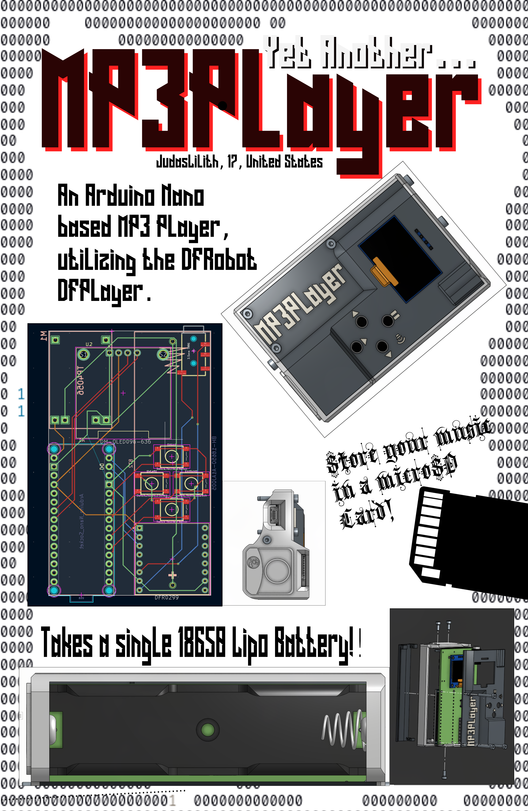

.png)

__Yet another MP3 Player, based on the DFRobot player. made for Hack Club Fallout(woohoo!!)__

## Introduction

Last year, the state of texas passed a law banning phones in all public schools. This came as a devastate effect for people who used their phones for academic purposes and people who listened to music in their free time. This situation made me find ways to listen to my playlist, and prompted me to make this project.

This project is highly influenced from other similar projects, such as:

* <https://github.com/Neutrino-1/Arduino-Soundpod> (this one even has a [instructables page](https://www.instructables.com/Arduino-Retro-Style-MP3-Player/))
* <https://fallout.hackclub.com/projects/755>
* <https://fallout.hackclub.com/projects/2789>

The MP3Player works by using the DFrobot DFPlayer, where all the songs are stored inside a microSD card. Each of the files have a specific 4-digit number, and those are used to find or traverse through the music.

### The BOM (Bill of Materials)

| __Name__ | __Link__ | __info__ |
| --- | :----: | :----: |
|DFRobot MP3 Player module | [original seller](https://www.dfrobot.com/product-1121.html) |lwk, clones do not matter just get cheap clones from Aliexpressor or sumn
| SD card | [amazon link](https://www.amazon.com/SanDisk-2-Pack-microSDHC-Memory-2x32GB/dp/B08J4HJ98L?dib=eyJ2IjoiMSJ9.vZOPhvVy61i3F4YWb85gvBN9TivlWRxkBdxGT6mhkzrr2qoTEqy-T085dcQkiHgQ50T8wFaHobhX3Bn9akFQ2pMYzg3VztGHldnhl0s0_EYRB-Rp3KkVSxzjlvpcTmK7J2RY-2pRxAW9iRSYLtOTnUO-DiF9LnDR1HmU_nCGZO2OBTu7ECz8RS16p9LKuOA_9fKiMNsyfdiDCwbHfyx_5KB52vt29O6nbrIOiH5t2c0.TdA2tApy7VmIYyeuANhf7nGBc2UW4OnBapWOyu5gnOk&dib_tag=se&keywords=sandisk+sd+cards&qid=1779154655&sr=8-1) | any type of SD card will do, this was what I was just used. |
| custom PCB board | [inside the step file](/link) | Will add the files in a minute |
|SSD1036 | [amazon link for bulk](https://www.amazon.com/Hosyond-Display-Self-Luminous-Compatible-Raspberry/dp/B09T6SJBV5?dib=eyJ2IjoiMSJ9.6uJuI5cggaMKzcvI3mu-dvbLKlj0wOWwlcQl8xbyRfobJ3b6c3TsCgL8d5_2lj8bLpLwA4m1hgeH44EIKLIRiKn3pWcYvAocKu5288WeMdbQmOFhvJb4ijzHVK9Dped37QJYRIt5XDpLywYeOpeQUfzYAYDSUoPxFf_L-H85uGiz8-c98xMIucxSm6GAxhSut_ObX1kKdCcg77o59dNTfLinpqeD7YGn54MTBzKJl70.jMLZNSco5vdolf4Xf3qk7ZSXTGG4EDmd4ni-0WYy83k&dib_tag=se&keywords=SSD1306&qid=1779242639&sr=8-3) | Anything is fine, just make sure it's compatible with the Adafruit display library |
|4 Buttons (depending on what kind of keys you want, alter the kicad pcb file) | N/A | I personally just use the common button keys on almost every arduino kits |
|6 M2 nuts | [amazon link](https://www.amazon.com/Fgruh-M2-M3-M4-M5/dp/B0FGX9JGC5?crid=2NT24WAXE91QV&dib=eyJ2IjoiMSJ9.bTnvM_SQYLnYjyxSTAjjl1uodreFeuz-DqdsShjjYoTxPRmYdLp0gsPrWAr6kup0ESoJtdRbpmtmB9dMdnlQeEkzhxx_JS9wCRuVgj6k9fjj47v8lrjGXZ4dK8EqRT23Y3vk3vRO8XoYZ6VclKd2-avzBNO6XllpkOqiz-HR-MxHtlevnvKI35uXiU8fplah3sifPqZ165s9ZiDBFIUkXdSgNPQKdu1qo5lP5ZVZgW8.DFK3ayGbvIMHyTdY6YLHADBtloOBhNXhUbNScAJskyk&dib_tag=se&keywords=m2%2Bbolt%2Bsocket%2Bhead%2Bassortment&qid=1781308895&sprefix=m2%2Bbolt%2Bscket%2Bhead%2Bassortment%2Caps%2C143&sr=8-5&th=1) | Any M2 nuts and bolts will do, just make sure that the nuts are at least 4.5mm on each parallel side.
| 3 M2-5mm Bolts | use above link | For the bottom plate of the casing |
|| Column1 M2-15mm Bolts | use above link | For connecting the middle casing, along with the top casing. |
|

## Assembly 

